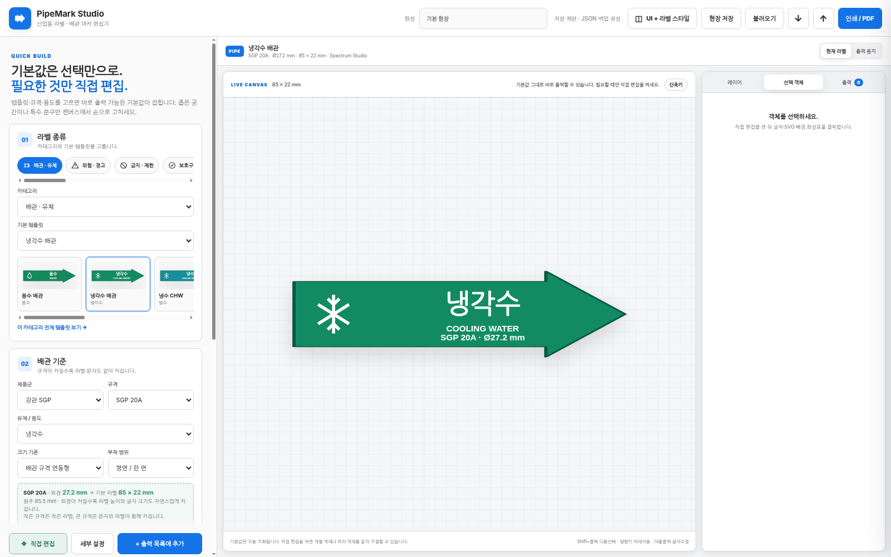
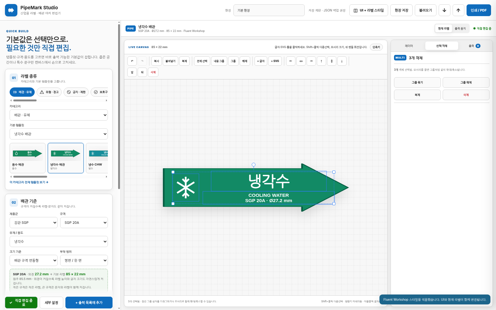
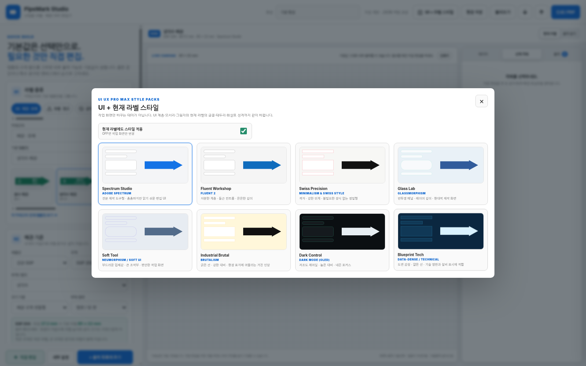
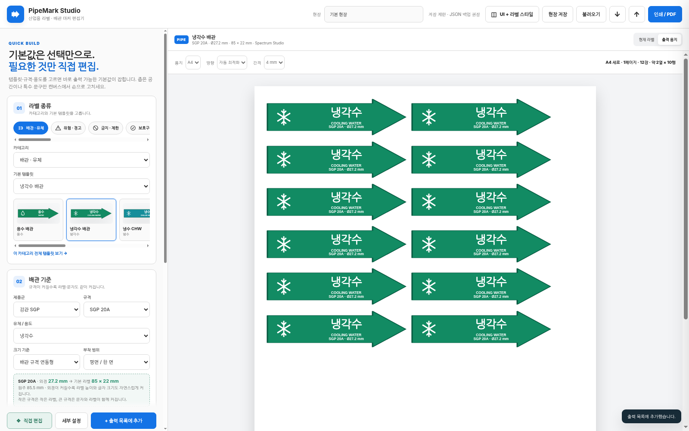

# PipeMark Studio v6

배관 마커, 산업안전 표지, 기계·설비·전기·화학·물류·LOTO·자산 라벨을 **기본값 선택으로 빠르게 만들고**, 예외 상황에서만 캔버스의 글자·SVG·틀을 직접 편집하는 GitHub Pages용 로컬 우선 웹앱입니다.

## Preview









## v6에서 달라진 점

### 1. UI + 라벨 스타일을 함께 변경

상단 **UI + 라벨 스타일**에서 다음 스타일 팩을 눈으로 비교해 선택할 수 있습니다.

- Spectrum Studio — Adobe Spectrum 계열의 전문 제작 도구형
- Fluent Workshop — Fluent 2 계열의 차분한 계층과 둥근 컨트롤
- Swiss Precision — Minimalism & Swiss Style 계열의 격자와 강한 위계
- Glass Lab — Glassmorphism 계열
- Soft Tool — Neumorphism / Soft UI 계열
- Industrial Brutal — Brutalism 계열
- Dark Control — Dark Mode OLED 계열
- Blueprint Tech — Data-Dense / Technical 계열

기본 설정은 **작업 UI와 현재 라벨을 함께 적용**합니다. 안전색·유체색처럼 의미가 있는 색상은 유지하면서, 글꼴·굵기·모서리·테두리·화살촉 비율·표면 효과가 스타일에 맞춰 변경됩니다. 체크를 끄면 UI만 바꿀 수도 있습니다.

스타일 명칭과 방향은 `nextlevelbuilder/ui-ux-pro-max-skill`의 스타일 카탈로그를 참고했습니다. 코드나 구성요소를 복제하지 않고 이 프로젝트에 맞는 디자인 토큰으로 재구성했습니다.

### 2. 객체 기반 직접 편집

라벨은 하나의 고정 그림이 아니라 다음 레이어로 나뉩니다.

- 배경 / 화살표
- SVG 심볼
- 큰 문구
- 보조 문구
- 배관 규격 문구
- 사용자가 추가한 텍스트 / SVG

**직접 편집**을 켜면 캔버스에서 바로 편집합니다.

- 클릭 후 드래그: 이동
- 모서리 핸들: 크기 조절
- 위 원형 핸들: 회전
- 글자 더블클릭: 캔버스에서 바로 수정
- Shift + 클릭: 여러 객체 선택
- 다중선택 테두리 드래그: 여러 객체 함께 이동
- 다중선택 모서리: 글자·심볼·간격까지 한 그룹처럼 비례 확대/축소
- 그룹 / 그룹 해제
- 정렬, 앞/뒤 순서
- 새 글자 / 새 SVG 추가

SVG는 비율 잠금을 켜면 원래 비율로, 끄면 가로·세로를 독립적으로 늘릴 수 있습니다.

### 3. 기본 편집 명령과 단축키

- `Ctrl + Z` 되돌리기
- `Ctrl + Y` 다시 실행
- `Ctrl + C` 복사
- `Ctrl + V` 붙여넣기
- `Ctrl + D` 복제
- `Ctrl + A` 전체 객체 선택
- `Ctrl + G` 그룹
- `Ctrl + Shift + G` 그룹 해제
- `Delete` 삭제
- 방향키: 0.5 mm 미세 이동
- `Shift + 방향키`: 2 mm 이동

글자 입력란과 캔버스 글자 편집에서는 **Enter로 직접 2줄/3줄**을 만들 수 있습니다. 자동 맞춤이 켜져 있으면 지정한 텍스트 상자를 벗어나지 않도록 글자 크기를 줄입니다.

### 4. 화살표 자체 편집

배경/화살표 레이어를 선택하면 다음을 바꿀 수 있습니다.

- 기본 / 양방향 / 리본 / 쉐브론 / 사각 / 캡슐 / 육각형
- 화살촉 길이 — 길게 하면 더 날카로운 인상
- 몸통 여백 — 화살 몸통 두께 조절
- 꼬리 홈
- 배경·강조·테두리 색
- 테두리 두께
- 모서리

화살촉은 캔버스의 마름모 핸들을 직접 끌어서도 바꿀 수 있습니다.

### 5. 규격에 따라 커지는 배관 라벨

`배관 규격 연동형`에서는 작은 배관과 큰 배관에 같은 라벨 크기를 쓰지 않습니다. 외경/단면 크기에 따라 기본 라벨과 문자 크기가 단계적으로 커집니다.

예시 시작값은 현장 출력 편의를 위한 프리셋이며 법정 고정치가 아닙니다. 사업장, 발주처, 안전규정의 지정 치수가 있으면 직접 수정하십시오.

보조 줄은 기본적으로 다음처럼 분리됩니다.

```text
COOLING WATER
SGP 20A · Ø27.2 mm
```

따라서 규격 정보가 긴 한 줄 끝에서 잘리는 문제를 줄였습니다.

### 6. 라벨 크기 변경과 내용 스케일

라벨 크기에는 두 방식이 있습니다.

- **내용도 같이 비례 조절 ON**: 라벨을 키우거나 줄이면 글자·SVG·간격도 전체적으로 같이 조절
- **OFF**: 라벨 틀만 변경하고 객체의 실물 크기를 가능한 한 유지

또한 객체 하나만 선택해 그 객체만 따로 크게 만들 수 있습니다.

### 7. SVG

내장 SVG 라이브러리 외에 사용자가 가진 `.svg` 파일을 추가할 수 있습니다. 추가 SVG는 브라우저에 로컬 저장됩니다.

업로드 시 script, iframe, 외부 URL 참조 등의 위험 요소를 제거한 뒤 사용합니다.

## 데이터 저장

서버 DB를 사용하지 않습니다.

- 현재 작업: LocalStorage 자동 저장
- 현장 저장본: LocalStorage
- 사용자 SVG: LocalStorage
- 출력 목록: LocalStorage
- PC 백업/복원: JSON

브라우저 데이터 삭제에 대비해 중요한 작업은 JSON 백업을 권장합니다.

## 출력

- A4 / A3
- 세로 / 가로 / 자동 최적화
- 실제 mm 기준 배치
- 작은 라벨은 한 페이지에 여러 열·행 자동 배치
- 라벨 크기가 커지면 열 수가 자연스럽게 감소
- 브라우저 인쇄 / PDF 저장

## 프로젝트 구조

```text
pipemark-studio-v6/
├─ index.html
├─ style.css
├─ app.js
├─ data/
│  ├─ catalog.js
│  └─ icons.js
├─ assets/
├─ manifest.webmanifest
├─ sw.js
├─ 404.html
├─ github-bootstrap.cmd
├─ github-publish.ps1
├─ start-local.cmd
└─ .github/workflows/deploy.yml
```

## 로컬 실행

가장 간단한 확인은 `index.html`을 직접 여는 것입니다. 일반 선택/편집/저장은 `file://`에서도 동작하도록 구성했습니다.

GitHub Pages와 같은 HTTP 환경에서 확인하려면 Windows에서:

```text
start-local.cmd
```

을 실행하십시오.

## GitHub Pages 게시

Windows에서는:

```text
github-bootstrap.cmd
```

을 실행합니다.

스크립트가 다음을 처리합니다.

1. Git 및 GitHub CLI 확인
2. GitHub 로그인 확인
3. 저장소 생성 또는 기존 저장소 연결
4. `origin`이 없으면 자동 추가
5. 기존 `main` 이력 연결
6. Repository Description / Website / Topics 설정
7. push
8. GitHub Pages를 Actions 방식으로 설정
9. 배포 워크플로 실행 상태 확인

실패 시 CMD 창이 닫히지 않으며 `github-bootstrap.log`에 기록됩니다.

게시 기본 URL:

```text
https://ko9ma7.github.io/pipemark-studio/
```

## Repository Social Preview

`assets/repository-social-preview.png`을 GitHub Repository의 **Settings → General → Social preview**에서 등록할 수 있습니다.

## 접근성 / 편집 UX

- 드래그 조작 외에도 우측 수치 입력과 방향키를 제공
- 키보드 포커스 표시
- 좁은 화면에서 필드 가로 넘침 방지
- 긴 문구 자동 맞춤
- 단축키 도움말 제공
- 직접 편집을 켜지 않으면 복잡한 도구를 숨김

## License

MIT License

